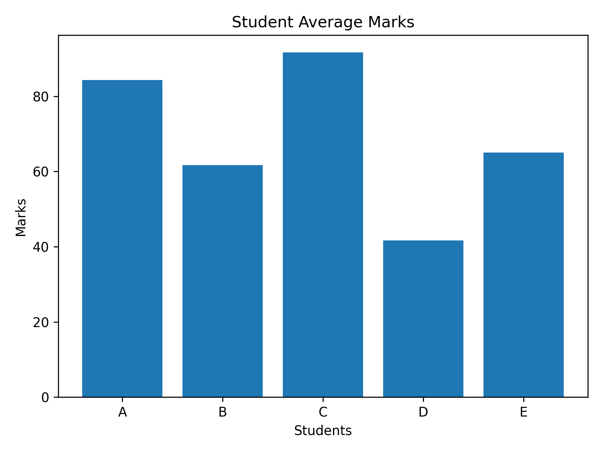

# DATA-VISUALIZATION-PROJECT
A Python Project visualizing data with graphs
# Data Visualization Project

## Overview
This project analyzes student marks data using Python and generates insights.

## Technologies Used
- Python
- Pandas
- Matplotlib

## Features
- Data preprocessing
- Data analysis
- Data visualization

## Author
Teja Meragala

## Visualization Output

